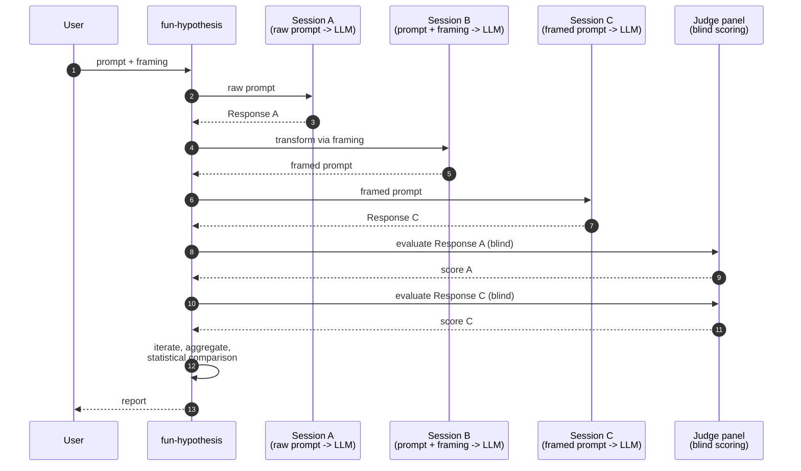

# Fun Hypothesis

[](https://github.com/ahb-sjsu/fun-hypothesis/actions/workflows/ci.yml)
[](https://pypi.org/project/fun-hypothesis/)
[](https://www.python.org/downloads/)
[](https://opensource.org/licenses/MIT)

Test whether different prompt framings affect LLM output quality.

## Hypothesis

LLM output quality varies based on how prompts are framed. This tool tests that hypothesis with rigorous double-blind methodology.

## Quick Start

```bash
pip install fun-hypothesis

# Run with default "fun" framing
fun-hypothesis --prompt "Explain quantum computing"

# Try different framings
fun-hypothesis --prompt "Explain quantum computing" --framing pirate
fun-hypothesis --prompt "Explain quantum computing" --framing expert
fun-hypothesis --prompt "Explain quantum computing" --framing eli5
```

## Built-in Framings

| Framing | Description |
|---------|-------------|
| `fun` | Make it engaging and playful |
| `pirate` | Like a pirate |
| `expert` | As a senior expert |
| `eli5` | Explain like I'm 5 |
| `formal` | Very formal and professional |
| `socratic` | As questions to explore |

## Methodology

1. **Session A**: Send raw prompt to LLM, collect response
2. **Session B**: Have LLM transform prompt with framing
3. **Session C**: Send framed prompt to LLM, collect response
4. **Session D**: Judge panel evaluates Response A (blind)
5. **Session E**: Judge panel evaluates Response C (blind)
6. Compare scores, iterate, aggregate, analyze

All sessions are independent (no context leakage). Judging is double-blind.



## Requirements

- Python 3.10+
- Anthropic API key (`ANTHROPIC_API_KEY` environment variable)

## Documentation

- [How It Works](framing-hypothesis-how-it-works.md)
- [Statistical Methodology](framing-hypothesis-statistical-methodology.md)

## License

MIT
